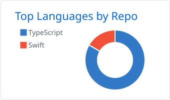
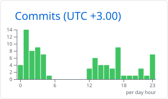

# Aleksey Ermakov

**TypeScript developer building maintainable backend, desktop, and web products.**

English · [Русский](README.ru.md)

---

## About

I build products end to end: typed APIs and data layers, cross-platform desktop apps, mobile clients, and the web frontends that tie them together. I care about predictable architecture, reproducible setups, and honest documentation. Each project below can be cloned and run as its README describes.

## Tech stack

<h4 align="center">Languages</h4>

<h4 align="center">Backend</h4>

<h4 align="center">Frontend, mobile & desktop</h4>

<h4 align="center">Data & infrastructure</h4>

## Featured projects

### [realfamousbae focus](https://github.com/realfamousbae/realfamousbae-focus)

Private countdown timers that sync across devices. Timers are scoped to the signed-in user and stored in Cloudflare D1. The app imports `.ics`/`.ical` and Google Calendar `.csv` files and handles recurring events, exclusions, duplicates, and time zones. The interface is available in English and Russian.

`Next.js 16` · `React 19` · `TypeScript` · `Cloudflare Workers & D1` · `Drizzle ORM` · `Vite`

→ [Live website](https://focus.realfam0usbae.chatgpt.site)

### [Limita](https://github.com/realfamousbae/limita)

A native macOS menu-bar app that shows Claude Code and Codex rate limits at a glance. A hover pill slides in at the top edge of any screen, away from the notch. Each service is polled live on its own schedule, and the dashboard marks stale data and shows readable errors. It reads credentials from the Keychain without ever refreshing or modifying them.

`Swift` · `SwiftUI` · `Keychain`

→ [Download DMG](https://github.com/realfamousbae/limita/releases)

### [Developer Profile API](https://github.com/realfamousbae/developer-profile-api)

A production-style, read-only GraphQL service built with NestJS. Prisma owns the persistence layer over CockroachDB. A single `docker compose up` starts the database, waits for it to be healthy, applies migrations, runs an idempotent seed, and then starts the API.

`NestJS` · `GraphQL (Apollo)` · `Prisma` · `CockroachDB` · `Docker`

### [My Staff](https://github.com/realfamousbae/my-staff)

A local-first Android app for collectors that turns photos of physical items into personal collectible cards. The original photos and SQLite data stay on the device. Sync goes through an account on your own NestJS + PostgreSQL backend, and backups export as portable ZIP archives. The data model keeps personal items separate from catalog editions.

`React Native` · `Expo` · `TypeScript` · `SQLite` · `NestJS` · `PostgreSQL`

→ [Try the APK](https://github.com/realfamousbae/my-staff/releases)

### [Hubble](https://github.com/realfamousbae/hubble)

A cross-platform workspace that runs web services (Telegram, YouTube, Discord, music, AI tools) as native tiles in one window. Version 1.0 is a full rewrite from Electron to Tauri 2 that uses the system webview instead of a bundled Chromium. It features BSP auto-tiling, isolated persistent sessions for each service, and media controls. Remote pages get no native IPC access.

`Tauri 2` · `Rust` · `TypeScript` · `React`

## GitHub activity

<picture>
  <source media="(prefers-color-scheme: dark)" srcset="./profile-summary-card-output/github_dark/1-repos-per-language.svg" />
  
</picture>
<picture>
  <source media="(prefers-color-scheme: dark)" srcset="./profile-summary-card-output/github_dark/4-productive-time.svg" />
  
</picture>

<picture>
  <source media="(prefers-color-scheme: dark)" srcset="https://streak-stats.demolab.com?user=realfamousbae&theme=github-dark-blue&hide_border=true" />
  
</picture>

