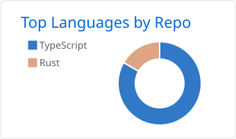
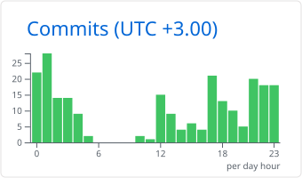

# Aleksey Ermakov

**TypeScript developer building maintainable backend, desktop, and web products.**

English · [Русский](README.ru.md)

---

## About

I build products end to end: typed APIs and data layers, cross-platform desktop apps, mobile clients, and the web frontends that tie them together. I care about predictable architecture, reproducible setups, and honest documentation. Each project below is public, and its README describes how to run it.

## Tech stack

<h4 align="center">Languages</h4>

<h4 align="center">Backend</h4>

<h4 align="center">Frontend, mobile & desktop</h4>

<h4 align="center">Data & infrastructure</h4>

## Featured projects

### [Veil](https://github.com/realfamousbae/Veil)

A private world map on OpenStreetMap with no accounts, cookies, or analytics. It is a static site with no backend: vector maps, place search, offline regions, saved places that stay on the device, and an installable PWA with light, dark, and paper themes. The privacy rules are written down as a contract and checked by an automated test in CI on every change.

`Svelte` · `MapLibre` · `PMTiles` · `TypeScript` · `PWA`

→ [Open the map](https://veil-239.pages.dev)

### [Limita](https://github.com/realfamousbae/limita)

A native menu-bar and tray app for macOS and Windows that shows Claude Code and Codex rate limits at a glance. A hover pill slides in at the top edge of any screen, and the dashboard shows 5-hour and weekly limits, countdowns to each reset, balances, and the reason whenever a live update fails. The macOS app is written in Swift. Version 0.3 adds a Windows port built with Tauri and Rust. Limita reads credentials but never stores or refreshes them.

`Swift` · `SwiftUI` · `Rust` · `Tauri` · `TypeScript`

→ [Download for macOS or Windows](https://github.com/realfamousbae/limita/releases)

### [realfamousbae focus](https://github.com/realfamousbae/realfamousbae-focus)

Private countdown timers that sync across devices. Timers are scoped to the signed-in user and stored in Cloudflare D1. The app imports `.ics`/`.ical` and Google Calendar `.csv` files and handles recurring events, exclusions, duplicates, and time zones. The interface is available in English and Russian.

`Next.js 16` · `React 19` · `TypeScript` · `Cloudflare Workers & D1` · `Drizzle ORM` · `Vite`

→ [Live website](https://focus.realfam0usbae.chatgpt.site)

### [Staya](https://github.com/realfamousbae/Staya)

An open-source iOS and Android app for sharing location with a small circle of friends. Coordinates are end-to-end encrypted on the device with Olm/Megolm, and the server stores only the ciphertext of the latest packet. There is no phone number, no email, and no movement history. Early development: not usable yet.

`Rust` · `Swift` · `SwiftUI` · `Kotlin` · `PostgreSQL`

### [Data Expedition](https://github.com/realfamousbae/data-expedition)

A Claude Code plugin and skill for deep investigation. It makes Claude work like a careful investigator instead of a fast summarizer: it analyzes repositories, researches the web across primary sources, and verifies claims before writing an evidence-backed report. It targets Claude Opus and Fable class models.

`Claude Code plugin` · `Python` · `Markdown`

### [RFB Jukebox](https://github.com/realfamousbae/drg-rfb-jukebox-music)

A Deep Rock Galactic mod that replaces all Space Rig jukebox songs with 39 custom tracks. It ships audio assets only, runs client-side, and fits every track to the exact duration the game allots to its slot.

`Python` · `PowerShell` · `Unreal Engine 4.27`

→ [Releases](https://github.com/realfamousbae/drg-rfb-jukebox-music/releases)

## GitHub activity

<picture>
  <source media="(prefers-color-scheme: dark)" srcset="./profile-summary-card-output/github_dark/1-repos-per-language.svg" />
  
</picture>
<picture>
  <source media="(prefers-color-scheme: dark)" srcset="./profile-summary-card-output/github_dark/4-productive-time.svg" />
  
</picture>

<picture>
  <source media="(prefers-color-scheme: dark)" srcset="https://streak-stats.demolab.com?user=realfamousbae&theme=github-dark-blue&hide_border=true" />
  
</picture>

